# Laboratorio de Testing

## Primera Parte - pytest, selenium

En esta ocacion realizamos un entorno de pruebas el cual estara documetnado a traves de la herramienta de reportes proporcionada por pytest, para ello en nuestra carpeta reports, encontramos los reportes generados en HTML, para este primer ejercicio, encontramos el reporte en el documento [Reporte_Selenium](./reports/report.html)

Cada uno de los test se encuentran declarados en la carpeta tests, mas especificamente en [Test_Selenium](./tests/test_search.py)

Los test estan relacionados en primer lugar a la comprension de como un test es aplicado a la valoracion de ciertos elementos dentro del aplicativo, este test valida la informacion del titulo del aplicativo [saucedemo](https://www.saucedemo.com/) 

El segundo test hace referencia a la validacion de un usuario y su correcto ingreso y redireccionamiento al index del aplicativo, la prueba del correcto funcionamiento esta en el reporte anteriormente mencionado, sin embargo a contiunuacion se presenta una imagen con el resultado 

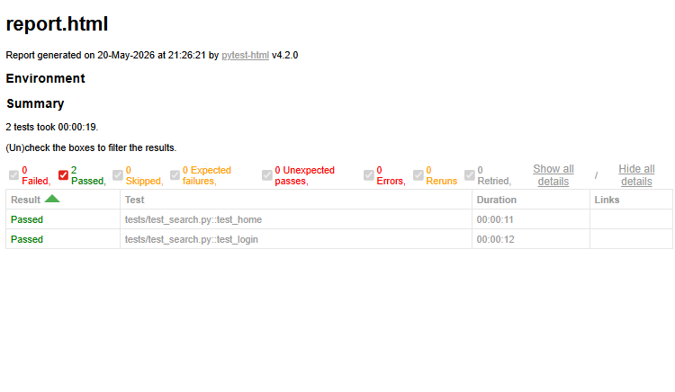

Estas pruebas se realizan en un entorno controlado en Chrome gracias a pytest

## Segunda parte - Cypress

En lo que respecta a cypress en cierto modo podemos decir que hace lo mismo que selenium, realiza pruebas automatizadas de software en aplicativos web, al ser entornos web, podemos identificar rapidamente que esta fundamentado en JavaScript, para iniciar, es necesario generar el entorno que nos permita ejecutar JS es por esto que inicializamos npm, posteriormente realizamos la instalacion de cypress, todo esto lo hacemos con los siguientes comandos:

`npm init -y` 
`npm install cypress --save-dev`

ahora inicalizarmeos cypress con el comando `npx cypress open`, una vez inicializado cypress veremos la siguiente pantalla

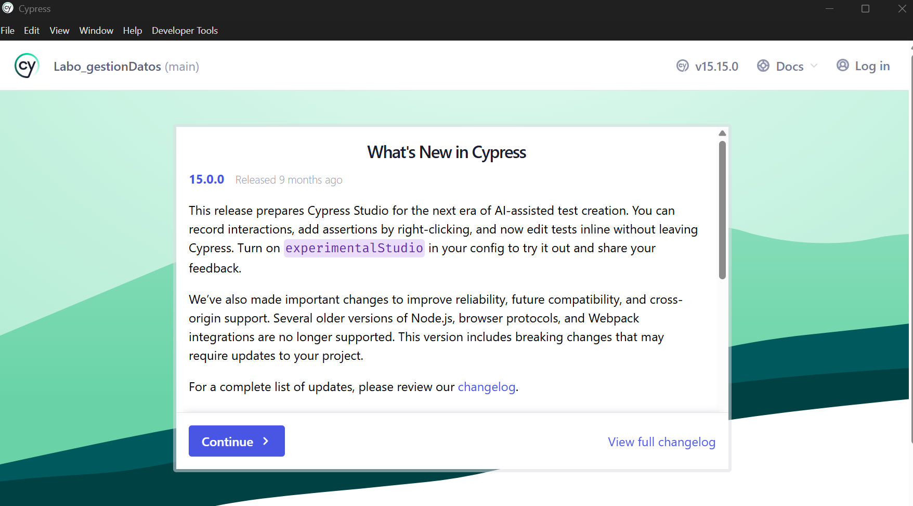

luego de esto nos pregunta que tipo de test realizarmos, en nuestro caso como estamos testeando el comportamiento de un usuario real de extremo a extremo (E2E), escogeremos dicha opcion.

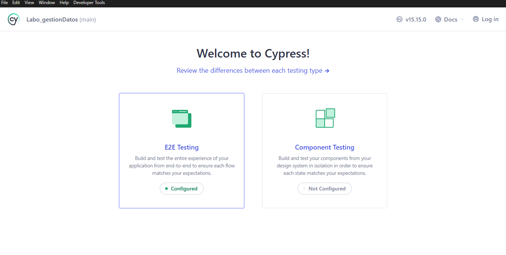

y por ultimo nos solicitar el motor de busqueda/browser que deseemos usar, en mi caso usare Chrome

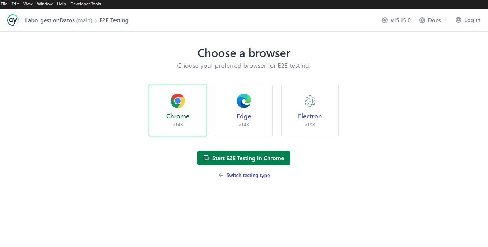

al inicializar el test veremos que en Chrome el aplicativo perteneciente al servicio cypress fundamenta 4 moculos, nosotros para la realizacionde los respectivos tests, usaremso los 'Specs' que en palabras sencillas son los tests personalizables, como se muestra en la imagen anterior.

En nuestro caso se realizaron 2 tests el primero relacionado al login el cual se encuentra en [test_login](./cypress/e2e/login.cy.js) este test basicamente captura cada uno de los elementos establecidos en la interfaz del login y en cada campo establece elementos previamente estipulados, adicionalmente realiza el submit respectivo y en caso tal de ser redireccionado al index del aplicativo en cuestion, el test es aprobado.

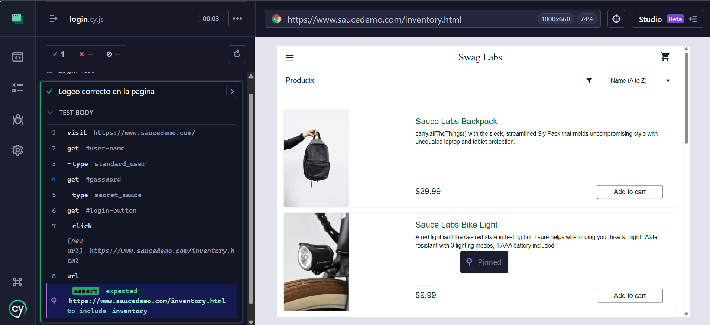

el otro test simplemente es el test por defecto que la creacionde un nuevo spect el cual es aprobado cuando se visita la pagina de ejemplo de cypress.

## Tercera parte - JMeter

A pesar de que en el taller original se establecia Load Runner como herramienta para la simulacion de muchos usuarios accesdiendo al aplicativo, este tiene una capa algo limitada, buscando en internet encontramos una alternativa que permite realizar la misma practica y es mas amigable con los usuarios que hasta ahora estan empezando en el mundo del teasting y esta es JMeter, para mas informacion [JMeter](https://jmeter.apache.org/)

Realizamos la descarga del software, dentro de la carpeta del software entramos en el directorio 'bin' y ejecutamos el archivo 'jmeter.bat' y una vez corriendo, el programa se vera algo asi.

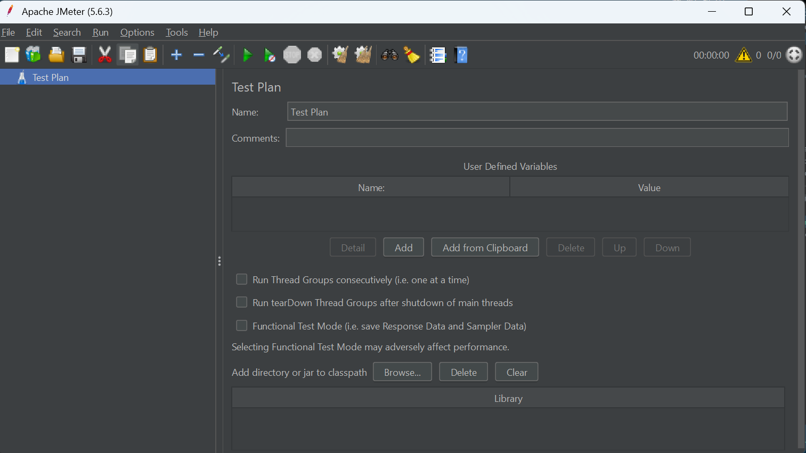

ahora realizaremos nuestro primer test con 10 usuarios a la pagina [sourcedemo.com](https://www.saucedemo.com)

En Jmeter se usa el concepto de Thread Group, el cual representa la cantidad e usuarios simultaneos que la pagina testeada soportara, para crear estos grupso iremos la siguiente opcion:

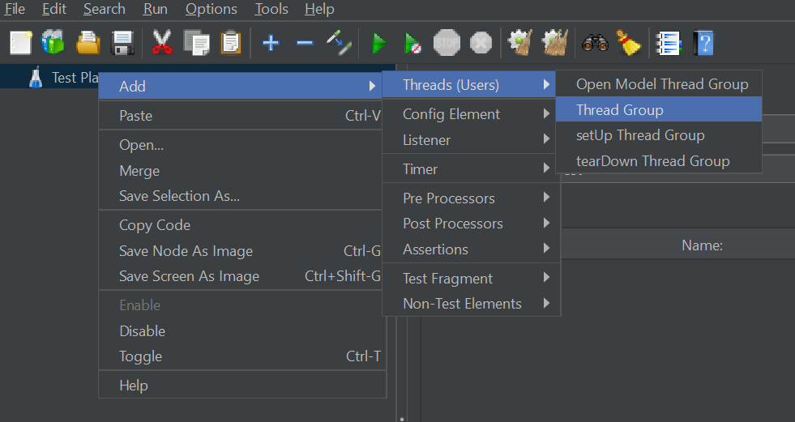

Una vez creado el grupo, realizamos la configuracion del grupo, en donde lanzaremso peticiones HTTP referentes a la visita del sitio en cuestion.

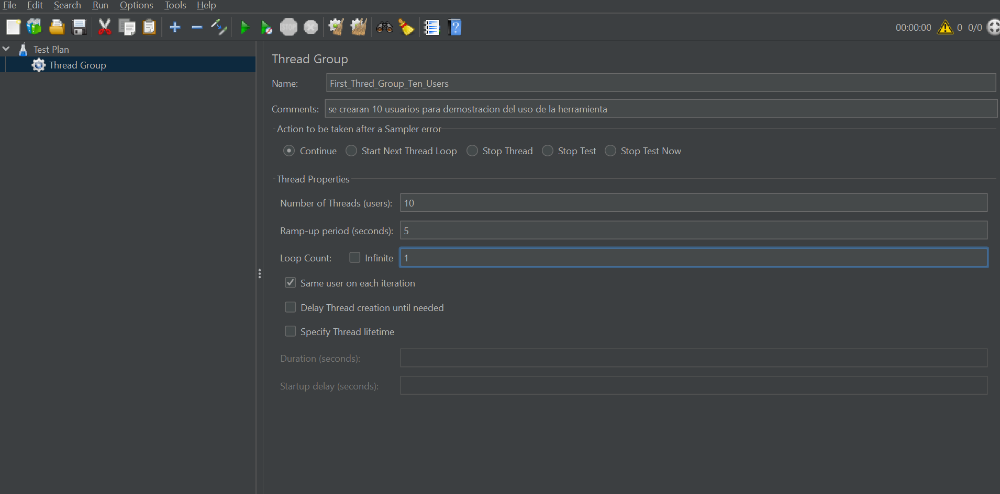

ahora mencionaremos a que pagina visitaremos a traves de las peticiones HTTP, esto lo logramoscon el siguiente flujo 
`click deracho sobre el grupo creado -> add -> sampler -> HTTP request` 

la configuracion de este apartado es el siguiente:

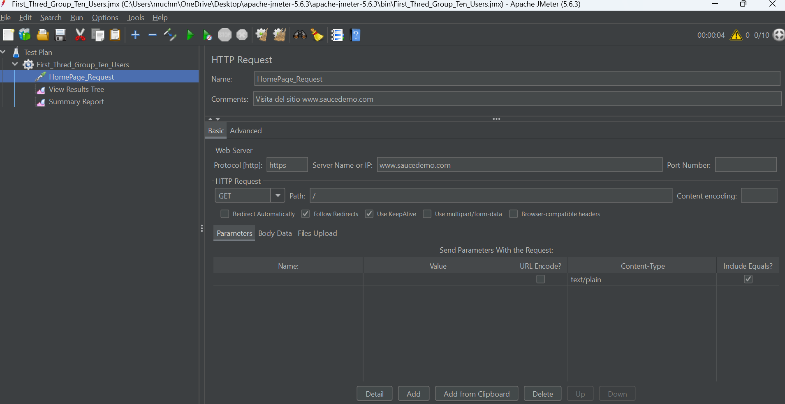

adicionalmente necesitamos ciertas pestañas donde visualizar los resultados arrojados al momento de hacer el test, estos elementos seran el arbol de resultados y el reporte resumen

`click deracho sobre el grupo creado -> add -> listener -> view resault tree/sumary report` 

al lanzar el test podemos ver lo siguiente, en el arbol de resultados:

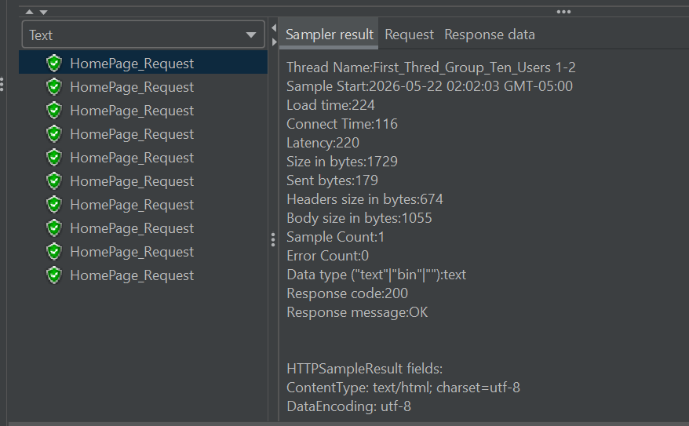

En lo que respecta al resumen se genera una tabla con los siguientes valores:

| Label  | #samples  | average  |  Min | Max  | std. Dev.  | error %  |  Througthput | Received KB/sec | sent KB/sec | Avg. Bytes  |
|---|---|---|---|---|
| HomePage_Request  | 10  |  159 |  87 |  619 | 158.04  | 0.0%  | 2.2/sec  |  3.75 |  0.38 | 1728.4  |
| TOTAL  | 10  |  159 |  87 |  619 | 158.04  | 0.0%  | 2.2/sec  |  3.75 |  0.38 | 1728.4  |

## Cuarta parte - ZAP 
Zap es uno de los softwares mas importantes para el analisis de seguridad de un aplicativo, despues de la descarga, e iniciar el software, la interfaz nos mostrara a traves de su inicio rapido el espacio para el ingreso de la direccion a la cual queremos hacer las pruebas.

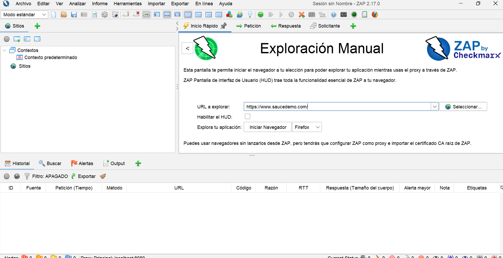

al iniciar la navegacion, lo que hace este software es revisar el trafico que se realiza en la pagina, incluyendo las peticiones post y get generadas.

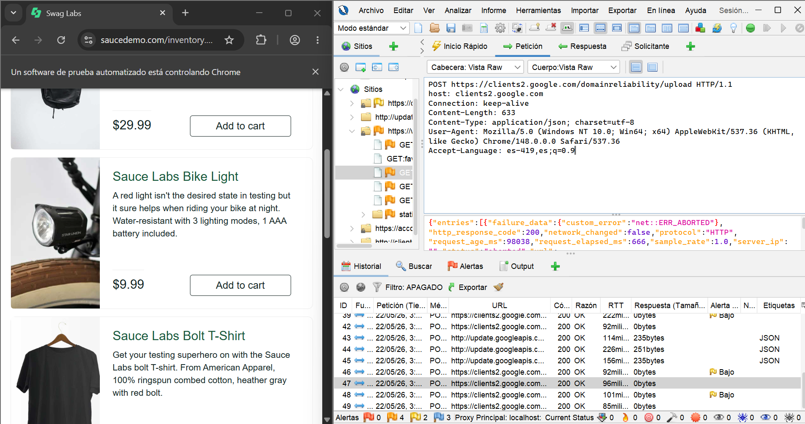

dentro de zap es posible visibilizar alertas que presentea el aplicativo que dependiendo de la gravedad se clasifican en High, medium, low, informational

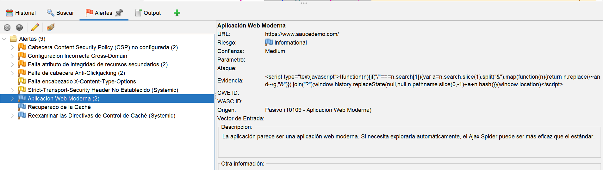

en pocas palabras nos permite evaluar los elementos que cada peticion requiere, escanea enpoints, trafico y lanza alertas que permiten visualizar informacion sobre la seguridad del aplicativo y muestran que tan robusta es dicha seguridad

## Quinta parte - mycrosoft clarity

Al igual que con Load Runner, en el trabajo original se usaba Hotjar, pero las limitaciones llevan a la implementacion de alternativas que permitan realizar la misma labor, en este caso usaremos microsoft Clarity.

Primeramente necesitamos una pagina de prueba para la implementacion de clarity, esta pagina esta en la carpeta [example](./example/) 

para su implementacion fue necesaria hostearla, esto lo logramos a traves de herramientas como [Netlify](https://app.netlify.com/)

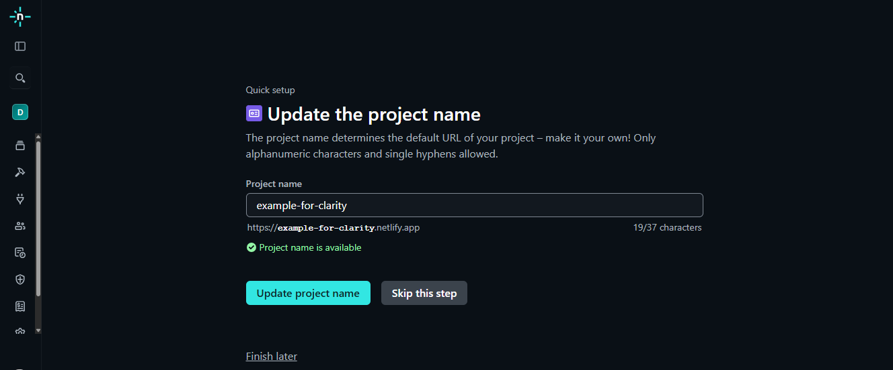

El sitio quedo hosteado y es accesible a traves del siguiente [link](https://example-for-clarity.netlify.app/)

una vez con una url adecuada para usar en clarity, procedemos a crear un nuevo proyecto.

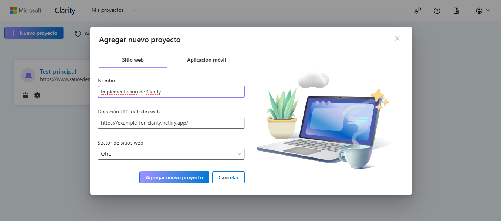

ahora realizaremos la instalacion manual de clarity en el proyecto, esto lo proporciona la pagina de clarity, en el head debemos copiar lo siguiente

``

En el [index](./example/index.html) se ve mucho mejor, ahora volvemos a subir el proyecto a netlify, y navegamos en la pagina, al volver a clarity, veremos que la grabacion del uso por parte de un usuario real se graba

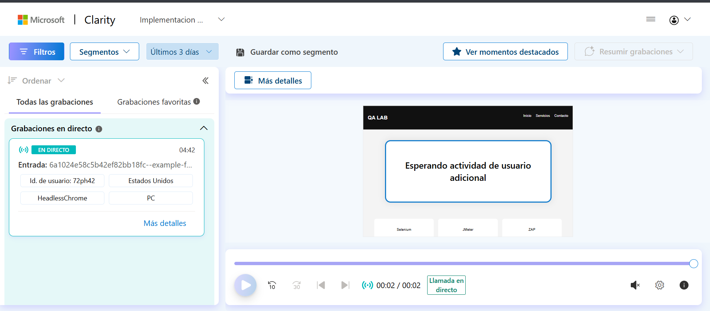

## Conclusion

El desarrollo de este laboratorio permitió comprender de manera práctica distintas áreas fundamentales del testing moderno aplicadas a aplicaciones web. A través de herramientas como Selenium y Cypress se realizaron pruebas funcionales automatizadas, validando comportamientos e interacciones de usuarios dentro del aplicativo.

Posteriormente, mediante JMeter, se analizaron aspectos relacionados con rendimiento y concurrencia, permitiendo simular múltiples usuarios y evaluar métricas importantes como tiempos de respuesta y throughput. Por otro lado, con OWASP ZAP se exploró el análisis de seguridad web, identificando tráfico, endpoints y posibles alertas relacionadas con vulnerabilidades.

Finalmente, Microsoft Clarity permitió observar el comportamiento real de los usuarios mediante grabaciones y mapas de calor, complementando las pruebas tradicionales con análisis de experiencia de usuario (UX).

En conclusión, el laboratorio permitió evidenciar que la calidad de software no depende únicamente del correcto funcionamiento de una aplicación, sino también de su rendimiento, seguridad y experiencia de usuario, integrando diferentes enfoques y herramientas ampliamente utilizadas en entornos profesionales.